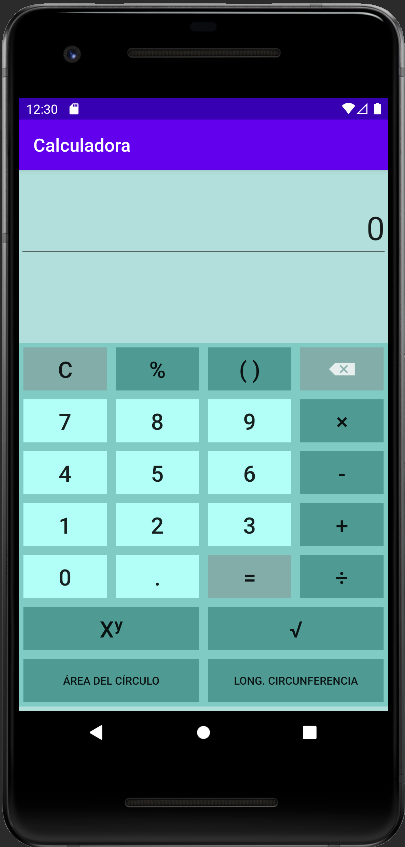

# Calculadora
Calculadora en Android Studio que realiza las siguientes funciones:\n
1.Suma
2.Resta
3.Multiplicación
4.División
5.Potencia
6.Raiz cuadrada
7.Calculo del área de un circulo
8.Calculo longitud de una circunferencia
## Samples

